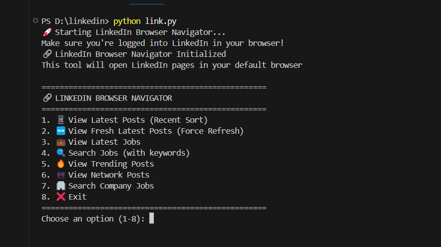
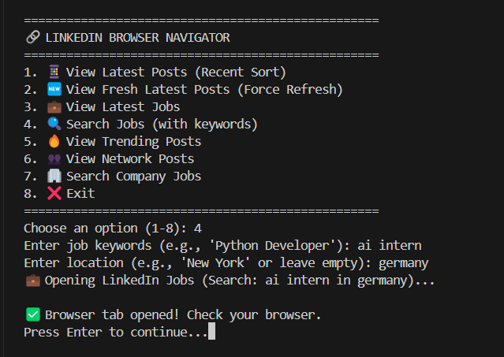

# 🔗 LinkedIn Browser Navigator

A Python-based tool that helps you easily navigate and view the latest LinkedIn posts and jobs directly in your browser. No more scrolling through algorithm-sorted feeds - get straight to the newest content!




## 🚀 Features

- **📱 Latest Posts**: View LinkedIn posts sorted by most recent activity with advanced cache-busting
- **🆕 Fresh Feed**: Force refresh with timestamp parameters to see absolute newest posts
- **⚡ Following Feed**: Chronological feed from people/pages you follow (most reliable for latest content)
- **🔧 Manual Sort Guide**: Step-by-step instructions for manually switching to recent sorting
- **💼 Latest Jobs**: Browse the most recent job postings
- **🔍 Job Search**: Search for specific jobs with keywords and location filters
- **🔥 Trending Posts**: View popular and trending LinkedIn content
- **👥 Network Posts**: See posts specifically from your connections
- **🏢 Company Jobs**: Search for jobs from specific companies
- **🎨 User-Friendly Interface**: Clean command-line menu system with troubleshooting tips

## 📋 Table of Contents

- [Installation](#installation)
- [Usage](#usage)
- [Features Breakdown](#features-breakdown)
- [Requirements](#requirements)
- [Contributing](#contributing)
- [Future Scope](#future-scope)
- [Collaboration](#collaboration)
- [License](#license)
- [Support](#support)

## 🛠️ Installation

### Prerequisites
- Python 3.6 or higher
- A web browser (Chrome, Firefox, Safari, Edge)
- Active LinkedIn account

### Clone the Repository
```bash
git clone https://github.com/rahulbedjavalge/linkedin.git
cd linkedin
```

### Install Dependencies
```bash
# No external dependencies required!
# All modules are built into Python
python --version  # Verify Python installation
```

### Run the Application
```bash
python linkedin_navigator.py
```

## 🎯 Usage

1. **Start the Application**
   ```bash
   python linkedin_navigator.py
   ```

2. **Login to LinkedIn**
   - Make sure you're logged into LinkedIn in your default browser

3. **Choose Your Action**
   - Select from the interactive menu (1-8)
   - The tool will open the appropriate LinkedIn page in your browser

4. **Navigate Seamlessly**
   - Switch between latest posts and jobs
   - Use search functionality for targeted results

### Example Usage
```bash
🔗 LINKEDIN BROWSER NAVIGATOR
==================================================
1. 📱 View Latest Posts (Recent Sort)
2. 🆕 View Fresh Latest Posts (Force Refresh)
3. ⚡ View Following Feed (Chronological)
4. 🔧 Manual Sort Instructions
5. 💼 View Latest Jobs
6. 🔍 Search Jobs (with keywords)
7. 🔥 View Trending Posts
8. 👥 View Network Posts
9. 🏢 Search Company Jobs
10. ❌ Exit
==================================================
Choose an option (1-10): 3
```

## 🔧 Features Breakdown

### 📱 Posts Management
- **Recent Sort**: Uses `?sortBy=recent` parameter with timestamp cache-busting to bypass LinkedIn's algorithm
- **Force Refresh**: Adds multiple parameters (`&refresh=true&_=timestamp&nocache=random`) to ensure fresh content loading
- **Following Feed**: Accesses `/feed/following/` for chronological posts from your network
- **Manual Sort Guide**: Provides step-by-step instructions for manual sorting when automated methods fail
- **Cache Busting**: Implements random parameters and timestamps to prevent browser/LinkedIn caching
- **Network Filter**: Focuses on posts from your direct connections
- **Trending View**: Algorithm-based popular content discovery

### 💼 Job Search Capabilities
- **Latest Jobs**: Sorted by posting date (newest first)
- **Keyword Search**: Filter jobs by specific terms
- **Location Filter**: Search jobs in specific geographical areas
- **Company-Specific**: Find all jobs from particular companies
- **Advanced Sorting**: Uses LinkedIn's `sortBy=DD` (Date Descending) parameter

### 🌐 URL Parameters Used
- `?sortBy=recent&t=timestamp&r=random` - Recent posts with cache-busting
- `?sortBy=relevance` - Trending posts
- `&refresh=true&_=timestamp&nocache=random` - Multiple force refresh parameters
- `&sortBy=DD` - Date descending for jobs
- `&keywords=` - Job keyword filtering
- `&location=` - Location-based filtering
- `/feed/following/` - Chronological following feed

## 📦 Requirements

### System Requirements
- **Operating System**: Windows, macOS, or Linux
- **Python**: 3.6 or higher
- **Browser**: Any modern web browser
- **Internet**: Active internet connection

### Python Dependencies
```python
# Built-in modules (no pip install required)
import webbrowser    # Browser automation
import time          # Timing operations
import os           # Operating system interface
from urllib.parse import quote_plus  # URL encoding
```

### Optional Dependencies (for future development)
```bash
pip install requests selenium beautifulsoup4 colorama
```

## 🤝 Contributing

We welcome contributions from the community! Here's how you can help:

### Ways to Contribute
1. **🐛 Bug Reports**: Found a bug? [Create an issue](https://github.com/rahulbedjavalge/linkedin/issues)
2. **💡 Feature Requests**: Have an idea? [Submit a feature request](https://github.com/rahulbedjavalge/linkedin/issues)
3. **🔧 Code Contributions**: 
   - Fork the repository
   - Create a feature branch (`git checkout -b feature/amazing-feature`)
   - Commit your changes (`git commit -m 'Add amazing feature'`)
   - Push to the branch (`git push origin feature/amazing-feature`)
   - Open a Pull Request

### Development Setup
```bash
# Fork and clone the repo
git clone https://github.com/YOUR_USERNAME/linkedin.git
cd linkedin

# Create a new branch for your feature
git checkout -b feature/your-feature-name

# Make your changes and test
python linkedin_navigator.py

# Commit and push
git add .
git commit -m "Description of your changes"
git push origin feature/your-feature-name
```

### Code Style
- Follow PEP 8 Python style guidelines
- Add comments for complex logic
- Include docstrings for functions
- Test your changes before submitting

## 🚀 Future Scope

### Phase 1: Enhanced Python Tool
- [ ] **Configuration File**: Save user preferences and frequently used searches
- [ ] **Command Line Arguments**: Direct execution with parameters
- [ ] **Batch Operations**: Open multiple LinkedIn pages simultaneously
- [ ] **Search History**: Remember and quickly access previous searches
- [ ] **Custom URL Builder**: Advanced URL parameter customization
- [ ] **Notification System**: Desktop notifications for new posts/jobs
- [ ] **Export Functionality**: Save job search results to CSV/JSON
- [ ] **Advanced Cache Control**: More sophisticated cache-busting techniques
- [ ] **LinkedIn Login Integration**: Automated login handling
- [ ] **Post Filtering**: Filter posts by date, keywords, or engagement levels

### Phase 2: Browser Extension
- [ ] **Chrome Extension**: Convert functionality to browser extension
- [ ] **Firefox Add-on**: Cross-browser compatibility
- [ ] **Quick Access Toolbar**: One-click access to latest posts/jobs
- [ ] **Keyboard Shortcuts**: Hotkeys for common actions
- [ ] **Context Menu Integration**: Right-click options on LinkedIn pages
- [ ] **Popup Interface**: Clean UI for extension interactions
- [ ] **Auto-Sort Feature**: Automatically switch LinkedIn feed to "Recent" sorting
- [ ] **Feed Refresh Button**: Quick refresh button for LinkedIn pages
- [ ] **Real-time Notifications**: Browser notifications for new posts in your feed

### Phase 3: Advanced Features
- [ ] **LinkedIn API Integration**: Official API access for enhanced functionality
- [ ] **Content Filtering**: Filter posts by keywords, companies, or industries
- [ ] **Job Alerts**: Real-time notifications for matching job postings
- [ ] **Analytics Dashboard**: Track your LinkedIn engagement and job search progress
- [ ] **AI-Powered Recommendations**: Smart suggestions based on your interests
- [ ] **Multi-Account Support**: Manage multiple LinkedIn accounts
- [ ] **Automated Actions**: Schedule posts, connection requests, and messages

### Phase 4: Enterprise Features
- [ ] **Team Collaboration**: Share job searches and posts with team members
- [ ] **Company Integration**: Corporate LinkedIn management tools
- [ ] **Recruitment Dashboard**: Enhanced tools for HR professionals
- [ ] **API for Third-party Integration**: Allow other applications to use our functionality
- [ ] **Mobile App**: iOS and Android applications
- [ ] **Advanced Analytics**: Detailed insights and reporting

## 🤝 Collaboration

We're actively seeking collaborators to expand this project! Here are specific areas where we need help:

### 🔍 Looking for Contributors

#### Frontend Developers
- **Chrome Extension Development**: Convert Python functionality to JavaScript
- **UI/UX Design**: Create intuitive interfaces for browser extension
- **React/Vue.js**: Build dashboard interfaces for advanced features

#### Backend Developers
- **API Development**: Build RESTful APIs for the tool
- **Database Integration**: User preferences and search history storage
- **LinkedIn API Integration**: Official API implementation

#### DevOps Engineers
- **CI/CD Pipeline**: Automated testing and deployment
- **Docker Containerization**: Easy deployment and distribution
- **Cloud Infrastructure**: Scaling for multiple users

#### Data Scientists
- **Machine Learning**: Content recommendation algorithms
- **Data Analysis**: LinkedIn engagement analytics
- **Natural Language Processing**: Post and job content analysis

### 📞 Contact for Collaboration

- **GitHub Issues**: [Create a collaboration issue](https://github.com/rahulbedjavalge/linkedin/issues)
- **Email**: rahulbedjavalge@gmail.com
- **LinkedIn**: Connect with the project maintainer
- **Discord**: Join our development community (coming soon)

### 🎯 Collaboration Opportunities

1. **Open Source Contribution**: Regular contributors become project maintainers
2. **Mentorship Program**: Experienced developers mentor newcomers
3. **Hackathons**: Organize LinkedIn-themed coding competitions
4. **Documentation**: Help improve guides and tutorials
5. **Testing**: Beta testing new features and bug reporting
6. **Translation**: Internationalization for global users

### 💼 Professional Collaboration

- **Startups**: Interested in building LinkedIn-related products
- **Enterprises**: Companies wanting to integrate LinkedIn functionality
- **Educational Institutions**: Students working on similar projects
- **Research Organizations**: Academic research on social media tools

## 📄 License

This project is licensed under the MIT License - see the [LICENSE](LICENSE) file for details.

```
MIT License

Copyright (c) 2025 Rahul Bedjavalge

Permission is hereby granted, free of charge, to any person obtaining a copy
of this software and associated documentation files (the "Software"), to deal
in the Software without restriction, including without limitation the rights
to use, copy, modify, merge, publish, distribute, sublicense, and/or sell
copies of the Software, and to permit persons to whom the Software is
furnished to do so, subject to the following conditions:

The above copyright notice and this permission notice shall be included in all
copies or substantial portions of the Software.
```

## 🆘 Support

### Getting Help
- **Documentation**: Check this README and code comments
- **Issues**: [GitHub Issues](https://github.com/rahulbedjavalge/linkedin/issues) for bug reports and feature requests
- **Discussions**: [GitHub Discussions](https://github.com/rahulbedjavalge/linkedin/discussions) for questions and ideas

### 🔧 Latest Posts Troubleshooting Guide

**Problem**: Still seeing old posts instead of latest ones?

**Solutions (Try in order)**:

1. **Use Following Feed (Recommended)**
   - Choose Option 3 in the menu
   - This shows chronological posts from people you follow
   - Most reliable method for latest content

2. **Clear Browser Data**
   ```bash
   # Complete steps for each browser:
   Chrome: Settings > Privacy > Clear browsing data > Select LinkedIn cookies
   Firefox: Ctrl+Shift+Delete > Select cookies and cache
   Safari: Preferences > Privacy > Manage Website Data > Remove LinkedIn
   ```

3. **Manual LinkedIn Sorting**
   - Use Option 4 for step-by-step instructions
   - Look for "Sort by" dropdown on LinkedIn
   - Switch from "Top" to "Recent"

4. **Hard Refresh Techniques**
   ```bash
   Windows: Ctrl + F5
   Mac: Cmd + Shift + R
   ```

5. **Mobile Alternative**
   - Try LinkedIn mobile app
   - Tap the ⚡ lightning icon for recent posts

**Still Not Working?**
- Your network might not have recent posts
- LinkedIn's algorithm varies by account type
- Consider following more active users for better recent content

### Troubleshooting

#### Common Issues
1. **Browser doesn't open**
   - Check if Python can access your default browser
   - Try running: `python -c "import webbrowser; webbrowser.open('https://google.com')"`

2. **LinkedIn shows old posts instead of latest**
   - **Solution 1**: Use Option 3 (Following Feed) - most reliable for chronological posts
   - **Solution 2**: Clear LinkedIn cookies and cache in your browser
   - **Solution 3**: Hard refresh the LinkedIn page (Ctrl+F5 or Cmd+Shift+R on Mac)
   - **Solution 4**: Use Option 4 for manual sorting instructions
   - **Solution 5**: Look for "Sort by" dropdown on LinkedIn page and select "Recent"

3. **Clearing LinkedIn Cache (Detailed Steps)**:
   ```bash
   # Chrome
   1. Go to Settings > Privacy and Security > Clear browsing data
   2. Select "Cookies and other site data" and "Cached images and files"
   3. Set time range to "All time" and click "Clear data"
   
   # Firefox  
   1. Press Ctrl+Shift+Delete
   2. Select "Cookies" and "Cache"
   3. Set time range to "Everything" and click "Clear Now"
   
   # Safari
   1. Go to Safari > Preferences > Privacy
   2. Click "Manage Website Data" > Remove linkedin.com data
   ```

4. **URLs not working**
   - Ensure you're logged into LinkedIn
   - Check your internet connection
   - Try accessing LinkedIn manually first

5. **Still seeing old posts after trying all solutions**
   - LinkedIn's algorithm may prioritize "relevant" over "recent" content
   - Try using LinkedIn mobile app and tap the ⚡ icon for recent posts
   - Consider that your network might not have posted recently

#### Error Reporting
When reporting bugs, please include:
- Python version (`python --version`)
- Operating system
- Browser being used
- Full error message
- Steps to reproduce

## 📊 Project Statistics

- **Language**: Python
- **Dependencies**: 0 external packages
- **Supported Platforms**: Windows, macOS, Linux
- **Browser Compatibility**: All modern browsers
- **Development Status**: Active
- **Version**: 1.1.0
- **Latest Update**: Enhanced latest posts functionality with multiple cache-busting techniques
- **Menu Options**: 10 different navigation options

## 🙏 Acknowledgments

- **LinkedIn**: For providing the platform that makes this tool useful
- **Python Community**: For the excellent built-in libraries
- **Open Source Contributors**: Everyone who will contribute to this project
- **Beta Testers**: Users who help identify bugs and suggest improvements

---

**⭐ Star this repository if you find it helpful!**

**🔗 Connect with us on LinkedIn for updates and networking!**

**🤝 Contributing makes this project better for everyone!**